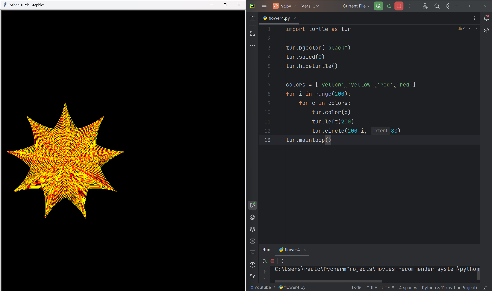

# Solar Flare

his code uses the Python Turtle library to create a stunning, colorful pattern that appears to swirl and burst like a solar flare. The pattern is formed by drawing a series of connected circles with decreasing radii, with each circle being drawn in a different color from the colors list. The hideturtle() function is used to hide the turtle, making the pattern more visually appealing.

# Tutorial is available on youtube channel 
click on the link to see :- ([Open in Youtube]())

# Screenshot

Rainbow-Spiral

# Features
Vibrant colors: The pattern features bright, vibrant colors that evoke the intense energy of a solar flare.
Swirling motion: The circles are drawn with a left turn of 200 degrees, creating a sense of swirling motion and dynamic energy.
Decreasing radii: The decreasing radii of the circles create a sense of depth and dimensionality, adding to the overall visual impact.

# Run
To run this code, save it to a file with a .py extension (e.g., solar_flare.py) and execute it using Python (e.g., python solar_flare.py). This will launch a window displaying the Solar Flare pattern.

# License
This code is licensed under the MIT License. Feel free to modify, distribute, and use it for any purpose.

# snake.coding
We create a project each 4 days with voting on our <a href="https://youtube.com/@snakecoding_12" target="_blank">Youtube</a> channel.
You can vote for upcoming projects on our channel **community** page :wink:

